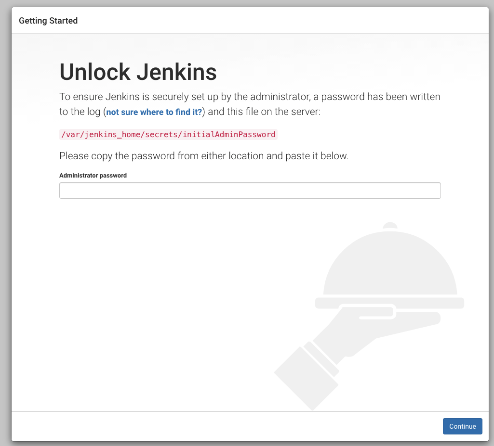
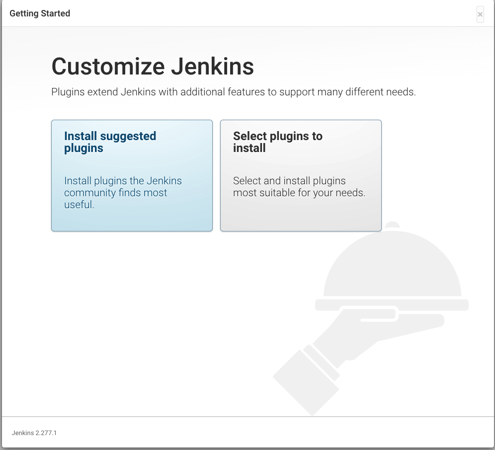
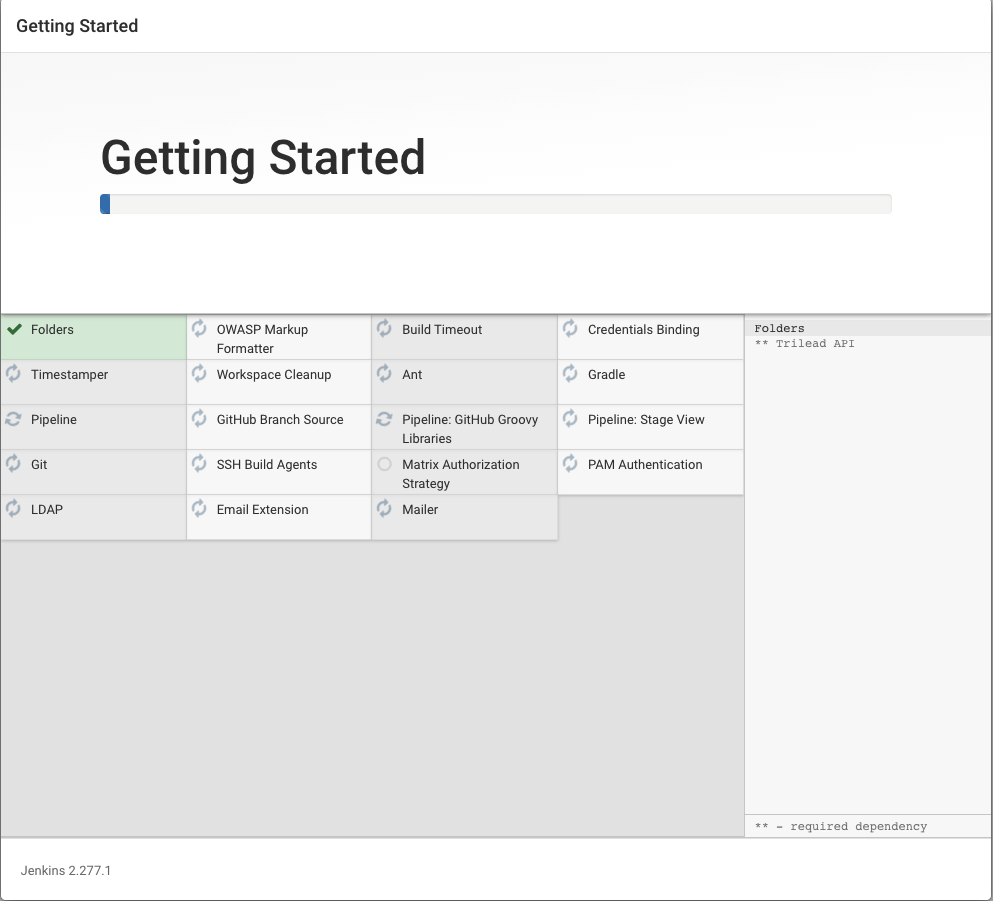
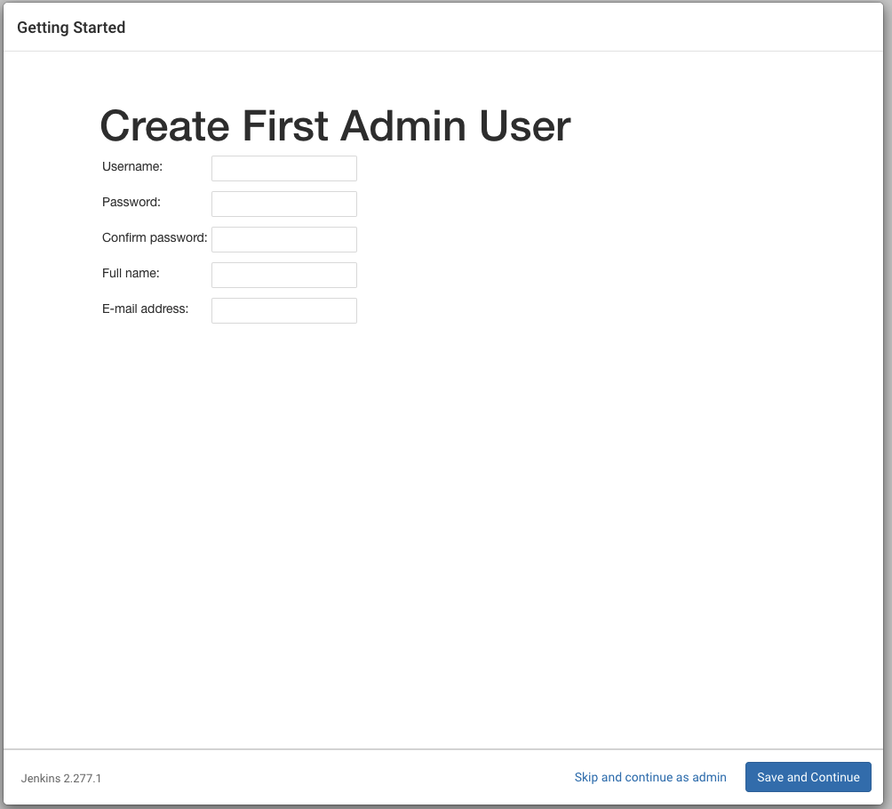
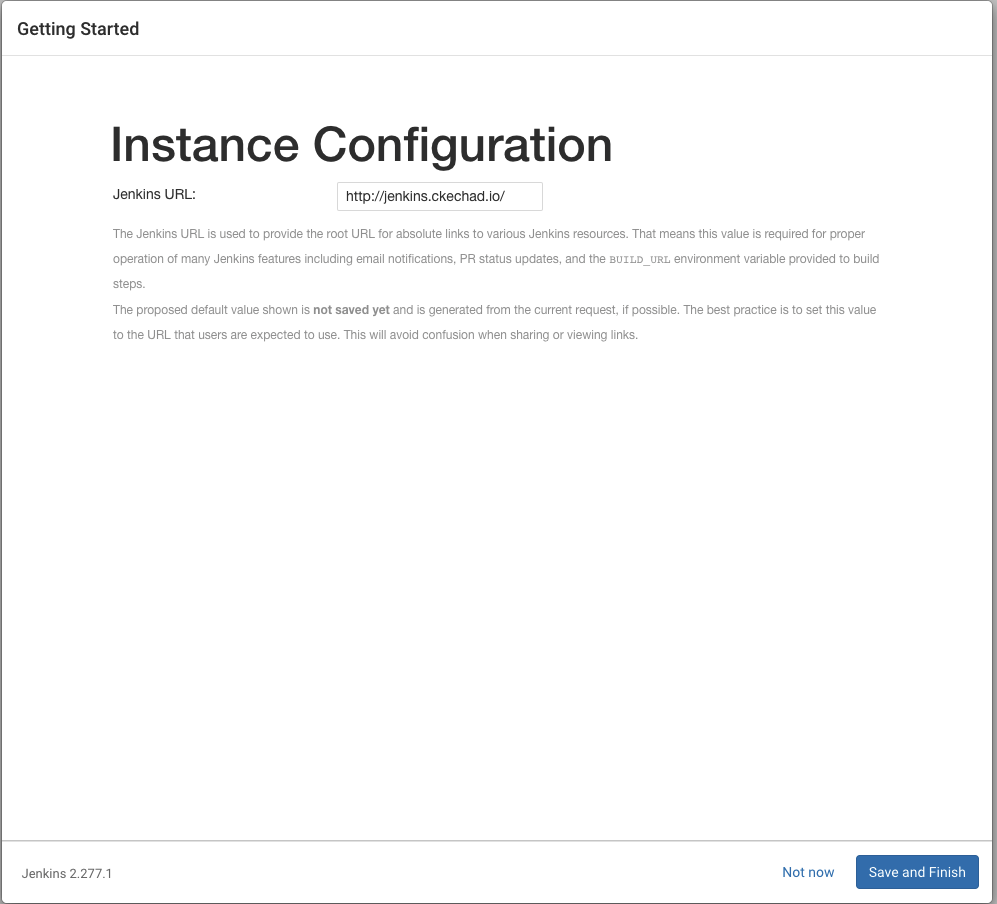

# Infra

## Start containers

`docker-compose up -d --remove-orphans`

## Nexus

- username: admin
- password: ` docker-compose exec nexus cat /nexus-data/admin.password`

## Jenkins

Step to install Jenkins

- Unlock Jenkins with this command `docker-compose exec jenkins cat /var/jenkins_home/secrets/initialAdminPassword`
  
- Install plugins
  
  
- Save first admin
  
- Set url  
  

## Sonar

- username: admin
- password: admin

## Stop/Down containers

- `docker-compose stop `
- `docker-compose down `
